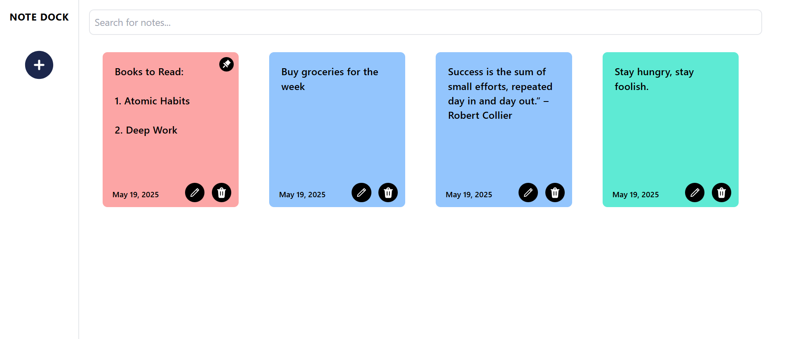
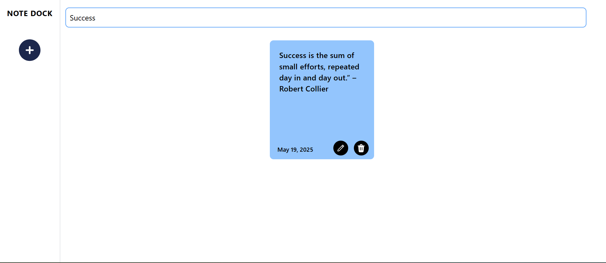
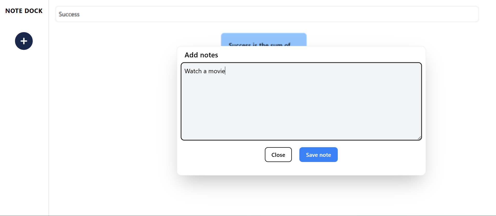

# 📝 Note Dock App

A feature-rich note-taking app built with **React**, **Context API**, and **useReducer**. Notes are editable, pinnable, and persist in **localStorage**. Smooth animations using **Framer Motion** and vibrant Tailwind color tags for each note.

> ✅ Pinned notes automatically shift to the top  
> 🔍 Live search filters notes in real-time



## 🚀 Live Demo

👉 [View Live](https://notedock.vercel.app)

---

## ✨ Features

- 🧠 Create, edit, delete, and pin notes
- 📌 Pinned notes are always displayed first
- 🎨 Random Tailwind colors assigned to each note
- 🔍 Real-time search with filter-as-you-type
- 💾 Auto-save to localStorage
- ⚛️ Smooth animations using Framer Motion

---

## 🛠️ Tech Stack

- React (Vite)
- Context API + useReducer
- Tailwind CSS
- Framer Motion
- localStorage (for persistence)

---

---

## 📸 Screenshots






---

## 🧠 Learning Outcomes

- Deepened understanding of React state management with Context + useReducer
- Real-world experience managing localStorage with reusable utility functions
- Practiced building responsive and animated UI
- Built a functional, visually appealing app from scratch

---

## 📦 Installation

```bash
git clone https://github.com/harsh-goyal-004/notedock.git

cd NoteDock
npm install
npm run dev

```

---

### 🙌 Author

---

Made with ❤️ by Harsh Goyal
